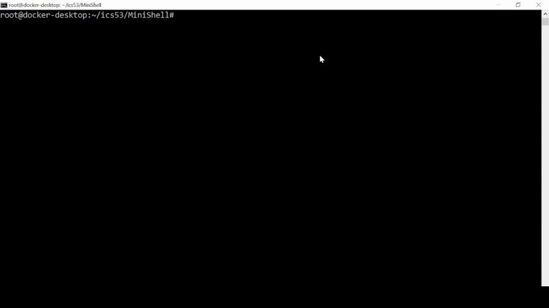

# :shell: MINI SHELL

## :open_book: OVERVIEW
Date: Feb 2024\
Developer(s): Ashneet Rathore\
Based on assignment instructions from Prof. Jennifer Wong-Ma


## :film_strip: DEMO


## :gear: HOW IT WORKS

## :open_file_folder: PROJECT FILE STRUCTURE
```bash
MiniShell/
│── src/
│   │── icssh.c        # Defines the main shell program
│   │── helpers.c      # Provides helper functions for the shell
│   └── linkedlist.c   # Implements linked list to track processes and cmd history
│── rsrc/
│   └── icssh.supp     # Suppresses Valgrind warnings during memory checks (for testing purposes)
│── lib/
│   └── icsshlib.o     # Provides pre-compiled helper functions
│── include/           # Contains header files (*.h) for source files (*.c)
│── Makefile           # Builds and cleans shell executable
│── README.md          # Project documentation
│── .gitignore         # Excludes files and folders from version control
└── demo.gif           # GIF showing the shell demo
```

## :rocket: SET UP & EXECUTION
**1. Clone the repository**
```bash
git clone https://github.com/ashneetrathore/MiniShell.git
```

**2. Run the program**
```bash
make clean
make
./bin/minishell
```

## :wrench: TRY IT OUT
